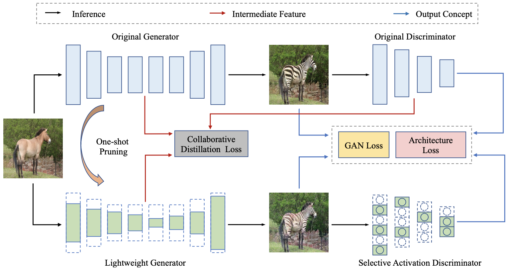

# Revisiting Discriminator in GAN Compression: A Generator-discriminator Cooperative Compression Scheme

## Overview




## Prerequisites

* Linux
* Python 3
* CPU or NVIDIA GPU + CUDA CuDNN

## Getting Started

### Installation

- Please type the command

  ```shell
  pip install -r requirements.txt
  ```

  to install dependencies.


### Data preparation

- cityscapes
- horse2zebra
- celeb
- Coco, Set5, Set14, B100, Urban100

### Pretrained Model

We provide a list of pre-trained models in [link](https://drive.google.com/drive/folders/1lDSguCuRDKl2bKQzAuc8hR-UE7eTqWvW?usp=sharing).

### Pre-Training For Pruning

Run the following script to pretrain a pix2pix on cityscapes dataset for generator pruning, 
all scripts for sagan, cyclegan, pix2pix, srgan can be found in ./scripts

```shell
bash scripts/pix2pix/pretrain_for_pruning.sh
```


### Training

- train lightweight generator using GCC
  
  ```shell
  bash scripts/pix2pix/train.sh
  ```

### Testing

- test resulted models, FID or mIoU will be calculated, take pix2pix generator on cityscapes dataset as an example

  ```shell
  bash scripts/pix2pix/test.sh
  ```

## Acknowledgements

Our code is developed based on [DMAD](https://github.com/junyanz/pytorch-CycleGAN-and-pix2pix), [Self-Attention-GAN](https://github.com/heykeetae/Self-Attention-GAN),  [pytorch-CycleGAN-and-pix2pix](https://github.com/junyanz/pytorch-CycleGAN-and-pix2pix),  [a-PyTorch-Tutorial-to-Super-Resolution](https://github.com/sgrvinod/a-PyTorch-Tutorial-to-Super-Resolution).